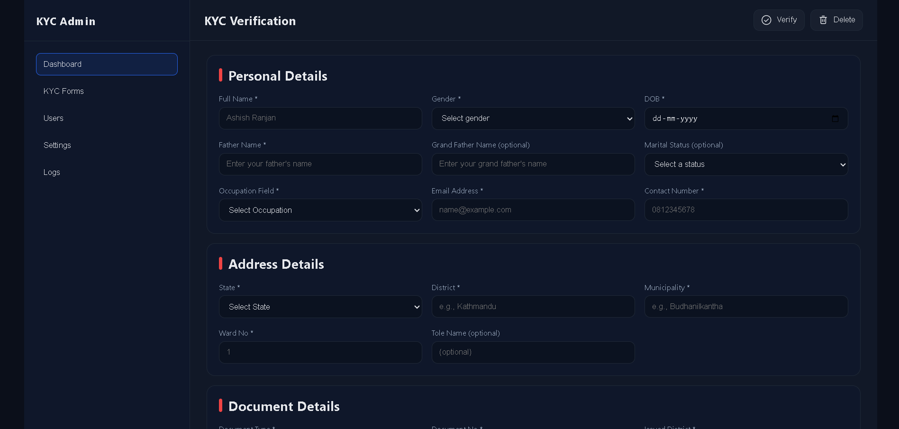

# KYC Verification



React-based KYC verification UI built with **styled-components**.
Includes a multi-section form (Personal, Address, Document, Profile Photo) with

-   **React Hook Form (RHF) + Yup** validation,
-   image preview & clear,
-   header actions (Verify/Delete),
-   **Toastify** toasts, and
-   **localStorage** draft auto-save/restore.
    Vite-powered and GitHub Pages–ready.

-   **Live:** https://a2rp.github.io/kyc-verification/
-   **Repo:** https://github.com/a2rp/kyc-verification

## ✨ Features

-   Clean two-column layout (sticky left menu, sticky header on right)
-   Form sections:
    -   **Personal:** Full name, gender, DOB, father name, grand father name (opt), marital status (opt), occupation, email, contact number
    -   **Address:** State, district, municipality, ward no, tole name (opt)
    -   **Document:** Document type (Citizenship / License / Passport), dynamic “Document No” label, issued district, date of issue
    -   **Profile Photo:** File input with live preview + clear
-   **Validation:** RHF + Yup (friendly messages, 10-digit phone, allowed file types/size)
-   **Header actions:** Verify → programmatic submit, Delete → programmatic reset
-   **Toasts:** Success / error / cleared (React Toastify)
-   **Drafts:** Auto-save to `localStorage` (text fields only), auto-restore on load, cleared on reset/success
-   **API-ready:** Fake API in place; swap with your real endpoint

## 🧱 Tech Stack

-   React (Vite)
-   styled-components
-   react-hook-form + @hookform/resolvers + Yup
-   react-toastify

## 🚀 Getting Started

```bash
# clone
git clone https://github.com/a2rp/kyc-verification
cd kyc-verification

# install
npm i

# dev
npm run dev

# build
npm run build

# preview production build
npm run preview
```
