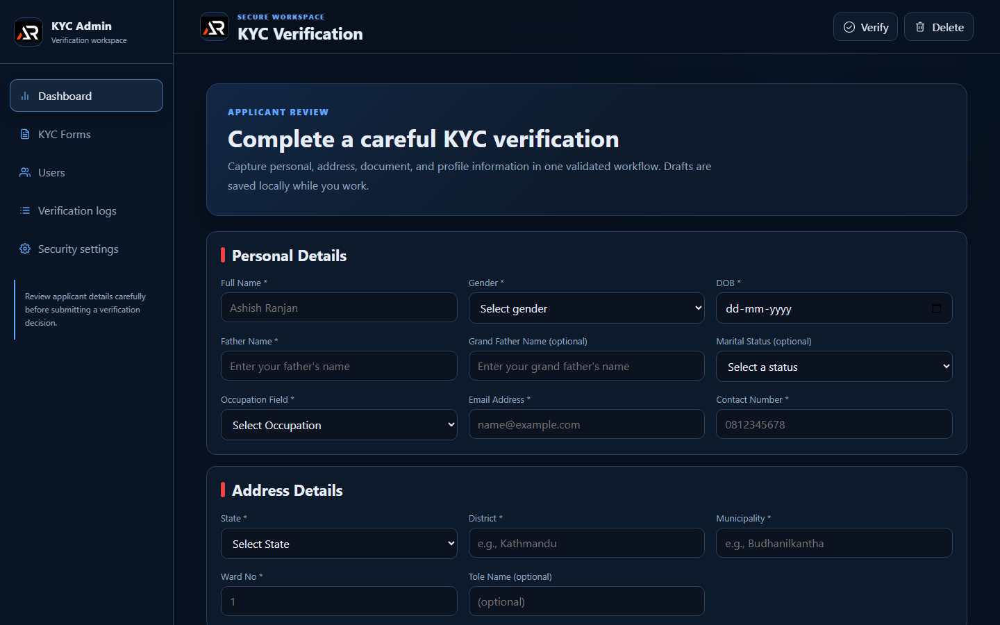

# KYC Verification

A responsive KYC verification workspace built with React. It collects applicant details, validates each section, previews a profile photo, and keeps text drafts available locally while the form is in progress.

## Features

- Personal, address, document, and profile photo sections
- React Hook Form and Yup validation
- Dynamic document number label based on document type
- Local draft save and restore
- Image preview and clear action
- Verify, reset, delete, and toast feedback actions
- Responsive fixed navigation, mobile menu, social sharing metadata, and go-to-top control

## Tech Stack

- React and Vite
- styled-components
- React Hook Form, Yup, and React Toastify
- react-icons

## Run Locally

~~~bash
npm install
npm run dev
~~~

Build and preview the production version:

~~~bash
npm run build
npm run preview
~~~

Live URL: https://a2rp.github.io/kyc-verification/

## Future Direction

The fake submission service can be replaced with a secure backend endpoint and real verification workflow.

## Links

- Portfolio: [https://www.ashishranjan.net/](https://www.ashishranjan.net/)
- GitHub: [https://github.com/a2rp](https://github.com/a2rp)
- CodePen: [https://codepen.io/ash1198](https://codepen.io/ash1198)
- LinkedIn: [https://www.linkedin.com/in/aashishranjan](https://www.linkedin.com/in/aashishranjan)
- Facebook: [https://www.facebook.com/theash.ashish/](https://www.facebook.com/theash.ashish/)
- YouTube: [https://www.youtube.com/@ashishranjan-ashz?sub_confirmation=1](https://www.youtube.com/@ashishranjan-ashz?sub_confirmation=1)
- Email: [ash.ranjan09@gmail.com](mailto:ash.ranjan09@gmail.com)

## Support

- Support: [https://a2rp-donation-page.netlify.app/](https://a2rp-donation-page.netlify.app/)
- Buy Me a Coffee: [https://buymeacoffee.com/a2rp](https://buymeacoffee.com/a2rp)
- Patreon: [https://patreon.com/a2rp](https://patreon.com/a2rp)